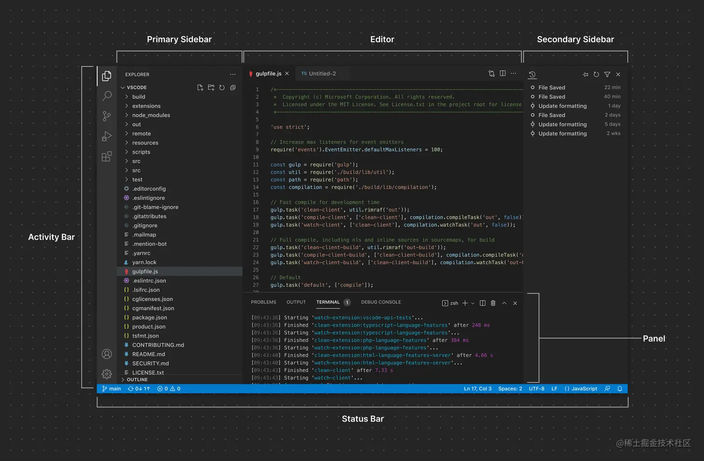
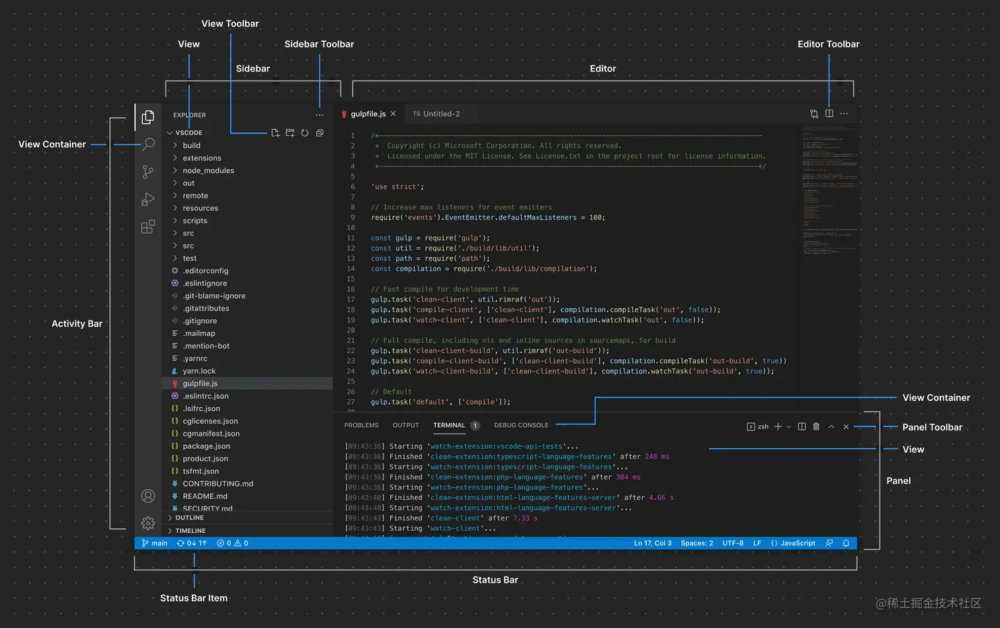

## 根据swagger文档，生成基于@umijs/max项目的CRUD页面(弹窗)

### 原理解析

swagger文档是一个json文件，里面包含了接口的详细信息，我们可以根据这些信息，生成对应的页面。
一个典型的openapi文档结构如下：
```json
{
  "openapi": "3.0.1",
  "info": {
    "title": "管理后台",
    "description": "提供管理员管理的所有功能",
    "contact": {},
    "license": {},
    "version": "1.0.0"
  },
  "paths": {
    "/admin-api/product/warehouse/base/update": {
      "put": {
        "tags": [
          "管理后台 - 仓库管理"
        ],
        "summary": "更新仓库",
        "operationId": "updateWarehouse",
        "parameters": [
          {
            "name": "id",
            "in": "query",
            "description": "仓库id",
            "required": true,
            "schema": {
              "type": "integer",
              "format": "int64"
            },
            "example": 1112
          },
          {
            "name": "name",
            "in": "query",
            "description": "仓库名称",
            "required": true,
            "schema": {
              "maxLength": 20,
              "minLength": 0,
              "type": "string"
            }
          },
          {
            "name": "remark",
            "in": "query",
            "description": "备注",
            "required": false,
            "schema": {
              "type": "string"
            }
          },
          {
            "name": "phone",
            "in": "query",
            "description": "仓库电话",
            "required": false,
            "schema": {
              "maxLength": 20,
              "minLength": 0,
              "type": "string"
            }
          },
          {
            "name": "locationProvince",
            "in": "query",
            "description": "所属省编码",
            "required": false,
            "schema": {
              "maxLength": 10,
              "minLength": 0,
              "type": "string"
            }
          },
          {
            "name": "locationCity",
            "in": "query",
            "description": "所属市编码",
            "required": false,
            "schema": {
              "maxLength": 10,
              "minLength": 0,
              "type": "string"
            }
          },
          {
            "name": "locationDistinct",
            "in": "query",
            "description": "所属区编码",
            "required": false,
            "schema": {
              "maxLength": 10,
              "minLength": 0,
              "type": "string"
            }
          },
          {
            "name": "addressDetail",
            "in": "query",
            "description": "详细地址",
            "required": false,
            "schema": {
              "maxLength": 10,
              "minLength": 0,
              "type": "string"
            }
          },
          {
            "name": "owner",
            "in": "query",
            "description": "负责人",
            "required": true,
            "schema": {
              "type": "string"
            }
          },
          {
            "name": "warehouseType",
            "in": "query",
            "description": "仓库类型，0总仓、1补货员仓、2设备仓",
            "required": false,
            "schema": {
              "type": "integer",
              "format": "int32"
            }
          },
          {
            "name": "ownerId",
            "in": "query",
            "required": false,
            "schema": {
              "type": "integer",
              "format": "int64"
            }
          }
        ],
        "responses": {
          "200": {
            "description": "OK",
            "content": {
              "*/*": {
                "schema": {
                  "$ref": "#/components/schemas/CommonResultBoolean"
                }
              }
            }
          }
        }
      }
    },
    "/rpc-api/product/warehouse/create": {
      "post": {
        "tags": [
          "RPC 服务 - 仓库Warehouse API 接口"
        ],
        "summary": "创建仓库",
        "operationId": "createWarehouse",
        "parameters": [
          {
            "name": "name",
            "in": "query",
            "description": "仓库名称",
            "required": true,
            "schema": {
              "maxLength": 20,
              "minLength": 0,
              "type": "string"
            }
          },
          {
            "name": "remark",
            "in": "query",
            "description": "备注",
            "required": false,
            "schema": {
              "type": "string"
            }
          },
          {
            "name": "phone",
            "in": "query",
            "description": "仓库电话",
            "required": false,
            "schema": {
              "maxLength": 20,
              "minLength": 0,
              "type": "string"
            }
          },
          {
            "name": "locationProvince",
            "in": "query",
            "description": "所属省编码",
            "required": false,
            "schema": {
              "maxLength": 10,
              "minLength": 0,
              "type": "string"
            }
          },
          {
            "name": "locationCity",
            "in": "query",
            "description": "所属市编码",
            "required": false,
            "schema": {
              "maxLength": 10,
              "minLength": 0,
              "type": "string"
            }
          },
          {
            "name": "locationDistinct",
            "in": "query",
            "description": "所属区编码",
            "required": false,
            "schema": {
              "maxLength": 10,
              "minLength": 0,
              "type": "string"
            }
          },
          {
            "name": "addressDetail",
            "in": "query",
            "description": "详细地址",
            "required": false,
            "schema": {
              "maxLength": 10,
              "minLength": 0,
              "type": "string"
            }
          },
          {
            "name": "owner",
            "in": "query",
            "description": "负责人",
            "required": true,
            "schema": {
              "type": "string"
            }
          },
          {
            "name": "warehouseType",
            "in": "query",
            "description": "仓库类型，0总仓、1补货员仓、2设备仓",
            "required": false,
            "schema": {
              "type": "integer",
              "format": "int32"
            }
          },
          {
            "name": "ownerId",
            "in": "query",
            "required": false,
            "schema": {
              "type": "integer",
              "format": "int64"
            }
          }
        ],
        "responses": {
          "200": {
            "description": "OK",
            "content": {
              "*/*": {
                "schema": {
                  "type": "integer",
                  "format": "int64"
                }
              }
            }
          }
        }
      }
    },
    "/app-api/product/spu/list": {
      "get": {
        "tags": [
          "用户 APP - 商品 SPU"
        ],
        "summary": "获得商品 SPU 列表",
        "operationId": "getSpuList_1",
        "parameters": [
          {
            "name": "recommendType",
            "in": "query",
            "description": "推荐类型",
            "required": true,
            "schema": {
              "type": "string"
            }
          },
          {
            "name": "count",
            "in": "query",
            "description": "数量",
            "required": true,
            "schema": {
              "type": "integer",
              "format": "int32",
              "default": 10
            }
          }
        ],
        "responses": {
          "200": {
            "description": "OK",
            "content": {
              "*/*": {
                "schema": {
                  "$ref": "#/components/schemas/CommonResultListAppProductSpuPageRespVO"
                }
              }
            }
          }
        }
      }
    },
    "/app-api/product/spu/get-detail": {
      "get": {
        "tags": [
          "用户 APP - 商品 SPU"
        ],
        "summary": "获得商品 SPU 明细",
        "operationId": "getSpuDetail",
        "parameters": [
          {
            "name": "id",
            "in": "query",
            "description": "编号",
            "required": true,
            "schema": {
              "type": "integer",
              "format": "int64"
            }
          }
        ],
        "responses": {
          "200": {
            "description": "OK",
            "content": {
              "*/*": {
                "schema": {
                  "$ref": "#/components/schemas/CommonResultAppProductSpuDetailRespVO"
                }
              }
            }
          }
        }
      }
    },
    "/app-api/product/favorite/delete": {
      "delete": {
        "tags": [
          "用户 APP - 商品收藏"
        ],
        "summary": "取消单个商品收藏",
        "operationId": "deleteFavorite",
        "parameters": [
          {
            "name": "spuId",
            "in": "query",
            "description": "商品 SPU 编号",
            "required": true,
            "schema": {
              "type": "number",
              "description": "商品 SPU 编号",
              "example": 29502
            },
            "example": 29502
          }
        ],
        "responses": {
          "200": {
            "description": "OK",
            "content": {
              "*/*": {
                "schema": {
                  "$ref": "#/components/schemas/CommonResultBoolean"
                }
              }
            }
          }
        }
      }
    }
  },
  "components": {
    "schemas": {
      "CommonResultBoolean": {
        "type": "object",
        "properties": {
          "code": {
            "type": "integer",
            "format": "int32"
          },
          "data": {
            "type": "boolean"
          },
          "msg": {
            "type": "string"
          }
        }
      },
      "CommonResultListAppProductSpuPageRespVO": {
        "type": "object",
        "properties": {
          "code": {
            "type": "integer",
            "format": "int32"
          },
          "data": {
            "type": "array",
            "items": {
              "$ref": "#/components/schemas/AppProductSpuPageRespVO"
            }
          },
          "msg": {
            "type": "string"
          }
        }
      },
      "CommonResultAppProductSpuDetailRespVO": {
        "type": "object",
        "properties": {
          "code": {
            "type": "integer",
            "format": "int32"
          },
          "data": {
            "$ref": "#/components/schemas/AppProductSpuDetailRespVO"
          },
          "msg": {
            "type": "string"
          }
        }
      }
    }
  }
}
```
- `info`: 表示这个文档的基本信息，包括标题、描述、联系人、许可证、版本等
- `paths`: 表示接口的路径，每个路径下面包含了接口的请求方式、请求参数、响应参数等
- `components`: 表示接口的组件，包括请求参数、响应参数等

根据`paths`和`components`，我们可以解析得到某个接口的请求参数、响应参数等信息，然后根据这些信息，生成对应的页面。
最典型的，根据`paths`中的`get`请求，我们可以生成一个查询页面，根据`paths`中的`post`请求，我们可以生成一个新增页面，根据`paths`中的`put`请求，我们可以生成一个修改页面，根据`paths`中的`delete`请求，我们可以生成一个删除页面。

然后，我们把这些数据用可视化的方式展示出来，用户可以根据自己的需求，对即将生成的页面进行定制化修改，然后点击生成按钮，就可以得到对应的页面了。

### 安装插件

### 配置插件

### 使用插件

### 生成的页面

### FAQ

### vscode插件开发 

#### 布局相关
在vscode中，它把整体分为了containers(图一)和items(图二)。containers可以理解为代表编辑器的某一个区域，items可以理解为代表该区域的内容。

如上图所示，主要包含：
- `活动栏(Activity Bar)`
  重要的导航入口。我们的常用的代码管理和搜索均通过该入口进入。我们可以创建View Container并提供给Activity Bar来扩展自定义导航入口
- `主侧边栏(Primary Sidebar)`
  主要是展示一个或多个Views，活动栏和主侧边栏紧密耦合，点击活动栏可以打开对应的主侧边栏，该绑定关系通过package.json中的配置进行关联
- `辅侧边栏(Secondary Sidebar)`
  主要是对主侧边栏的辅助作用，基本与主侧边栏一致
- `编辑器(Editor)`
  我们使用的最多的区域，包含一个或多个编辑器组，可以自定义编辑器或创建Webview视图，该区域还可以对编辑器操作栏（Editor Toolbar） 进行扩展
- `控制面板(Panel)`
  可以在面板中的单个选项卡中查看终端、问题和输出等视图。可以扩展自定义视图容器
- `状态栏(Status Bar)`
  提供有关工作区的当前活动文件的上下文信息，左侧表示整个工作区的状态，右侧表示当前活动文件的状态


如上图所示，主要包含：
- `视图（View）`：视图可以通过Tree View\Welcome View\Webview View的形式提供，视图的类型可以通过package.json中进行配置
- `视图工具栏（View Toolbar）`
  主要用于扩展特定于视图的操作按钮
- `侧边栏工具栏（Sidebar Toolbar）`
  主要用于扩展侧边栏的操作按钮
- `编辑器工具栏（Editor Toolbar）`
  主要用于扩展编辑器区域的操作按钮
- `控制面板工具栏（Panel Toolbar）`
  可以扩展当前选定视图的选项
- `状态栏（Status Bar Item）`
  主要增强状态栏，左侧状态栏表示整个工作区的状态，右侧表示当前活动文件的状态

#### `contributes`配置说明
```js
{
  "contributes": {
    // 插件配置项
    "configuration": {
      "type": "object",
      // 插件配置项的标题，会显示在vscode的设置页面
      "title": "vscode-plugin-demo",
      "properties": {
        // 配置项的节点，以及配置项的类型、默认值、描述
        "vscode-plugin-demo.enable": {
          "type": "boolean",
          "default": true,
          "description": "是否开启vscode-plugin-demo"
        }
      }
    },
    // 插件命令
    "commands": [
      {
        "command": "extension.sayHello",
        "title": "Hello World"
      }
    ],
    // 插件菜单
    "menus": {
      // 编辑器右键菜单
      "editor/context": [
        {
          // 表示当编辑器聚焦的时候才会在菜单中出现
          "when": "editorFocus",
          // 执行的命令，即插件命令中的command
          "command": "extension.sayHello",
          /**
           * 分组。值有：
           * - navigation: 永远排在最前面
           * - 1_modification: 更改组
           * - 9_cutcopypaste: 剪切复制粘贴组
           * - z_commands: 最后一个默认组，包含用于打开命令选项板的条目
           * 
           * 除了navigation是强制在最前面之外，其他分组都是按照0-9, a-z的顺序排列。
           * 如果你想在1_modification和9_cutcopypaste之间插入一个新的组别的话，可以使用诸如6_my这样的命名。
           */
          "group": "navigation@6",
          "title": "Hello World"
        }
      ],
      "editor/title": [
        {
          "when": "editorFocus",
          "command": "extension.sayHello",
          "group": "navigation",
        }
      ],
      "editor/title/context": [
        {
          "when": "editorFocus",
          "command": "extension.sayHello",
          "group": "navigation",
        }
      ],
      // 资源管理器右键菜单
      "explorer/context": [
        {
          "when": "resourceLangId == json",
          "command": "extension.sayHello",
          /**
           * 资源管理器里的分组有：
           * - navigation: 永远排在最前面
           * - 2_workspace: 与工作空间操作相关的命令
           * - 3_compare: 与差异编辑器中的文件比较相关的命令
           * - 4_research: 与在视图中搜索相关的命令
           * - 5_cutcopypaste: 与剪切复制粘贴相关的命令
           * - 7_modification: 与修改文件相关的命令
           */
          "group": "navigation@6",
          "title": "Hello World"
        }
      ]
    },
    // 快捷键绑定
    "keybindings": [],
    // 代码片段
    "snippets": [],
    "viewsContainers": {
      // 侧边栏
      "activitybar": [
        {
          "id": "testView",
          "title": "Test View",
          "icon": "images/icon.png"
        }
      ],
      // 侧边栏的菜单
      "sidebar": [
        {
          "id": "testView",
          "title": "Test View",
          "icon": "images/icon.png"
        }
      ],
      // 编辑器底部
      "panel": [
        {
          "id": "testView",
          "title": "Test View",
          "icon": "images/icon.png"
        }
      ]
    },
    // 侧边栏的内容
    "views": {
      // 跟上面viewsContainers中的id对应
      "testView": [
        {
          "type": "webview",
          "id": "testView",
          "name": "Test View",
          "icon": "images/icon.png",
          "title": "Test View",
          "viewId": "testView",
          "webviewPath": "testView.html"
        }
      ]
    },
    // 图标主题
    "iconThemes": [
      {
        "id": "testIconTheme",
        "label": "Test Icon Theme",
        "path": "./icons/testIconTheme"
      }
    ],
  }
}
```
